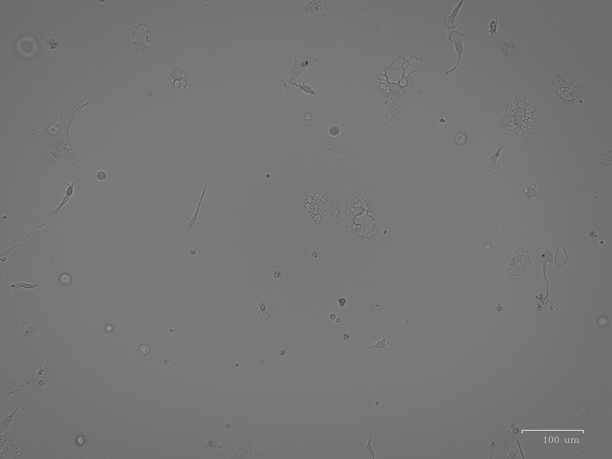
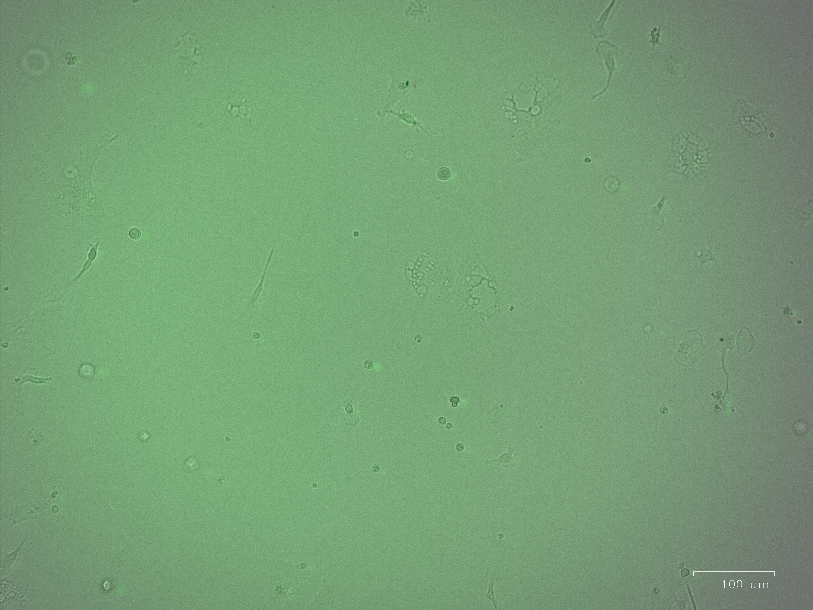

# pLenti_random_MOI_1 protamine_5.jpg

[] | [] | []

# pLenti_random_MOI_1 polybrene_5.jpg

[] | [] | []

# pLenti_random_MOI_1.jpg

[] | [] | []

# pLenti_random_MOI_1 polybrene_10.jpg

[] | []

# pLenti_random_MOI_1 protamine_10.jpg

[] | [] | []

# pLenti_random_MOI_ polybrene_10.jpg

[]

