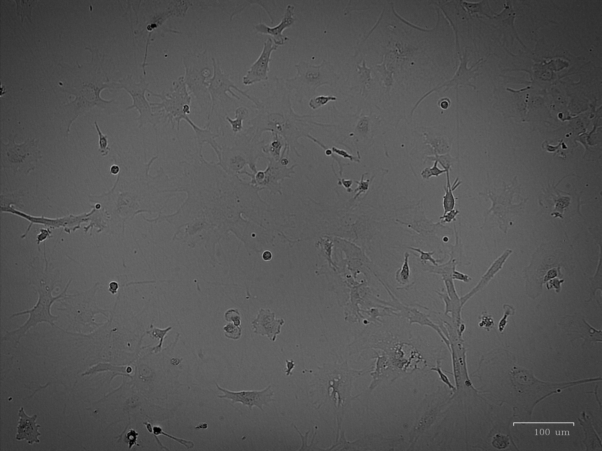
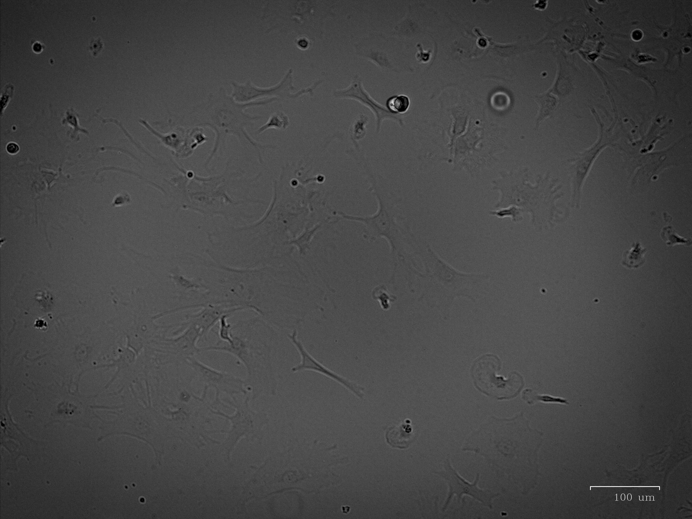
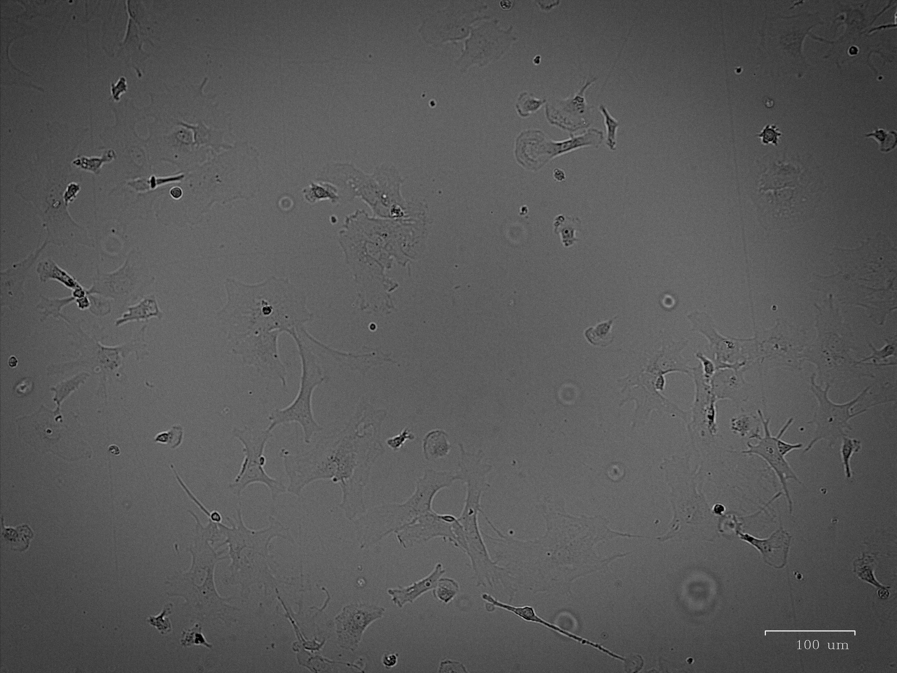
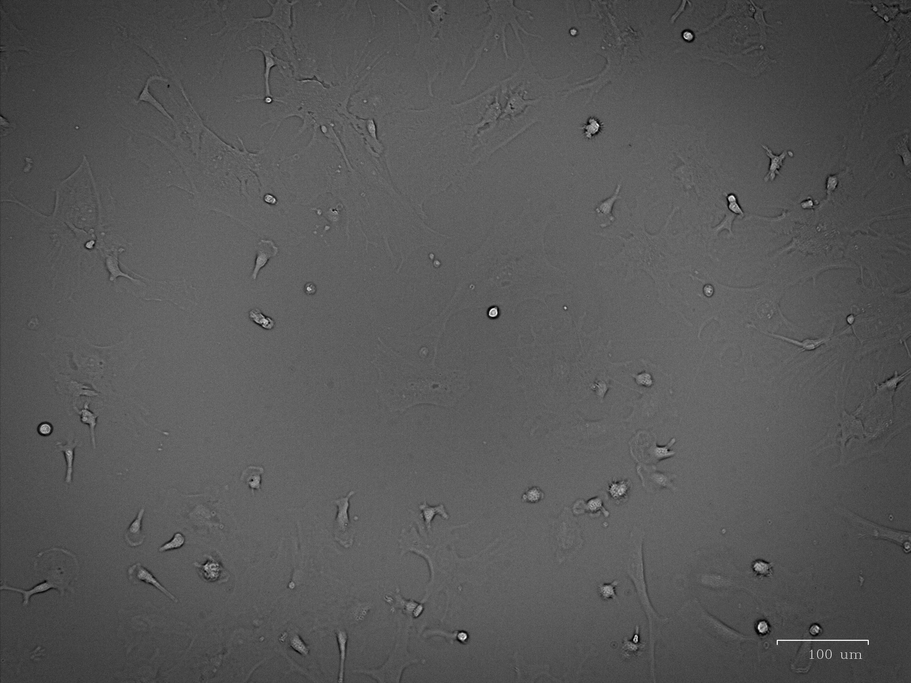
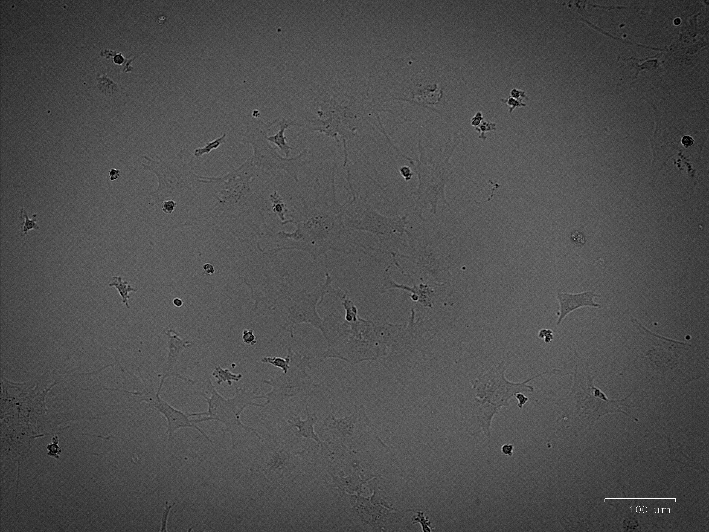

### Astro_before_treatment

[]

Astro_before_treatment.jpg

### Astro_before_treatment_2

[]

Astro_before_treatment_2.jpg

### DMSO_2uL

[]

DMSO_2uL.jpg

### DMSO_2uL_IL-1B_10uMng:ml_6hrs

[]

DMSO_2uL_IL-1B_10uMng:ml_6hrs.jpg

### same_time_WIN_1uM

[]

same_time_WIN_1uM.jpg

### same_time_WIN_1uM_IL-1B_10uMng:ml_6hrs

[]

same_time_WIN_1uM_IL-1B_10uMng:ml_6hrs.jpg

### same_time_WIN_10uM

[]

same_time_WIN_10uM.jpg

### same_time_WIN_10uM_IL-1B_10uMng:ml_6hrs

[]

same_time_WIN_10uM_IL-1B_10uMng:ml_6hrs.jpg

