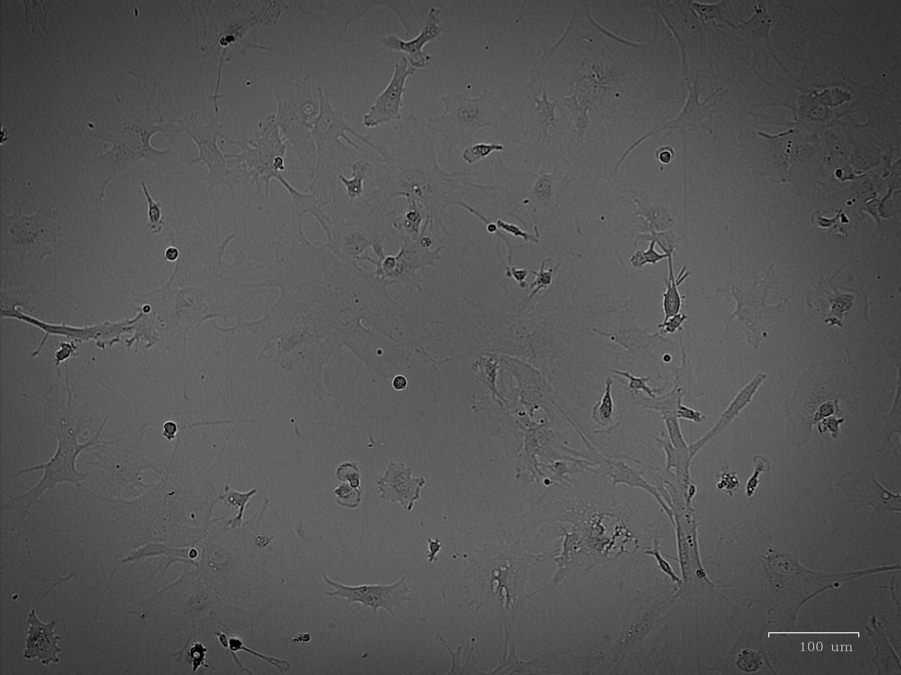
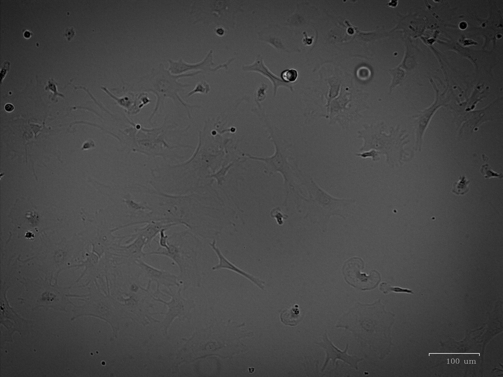
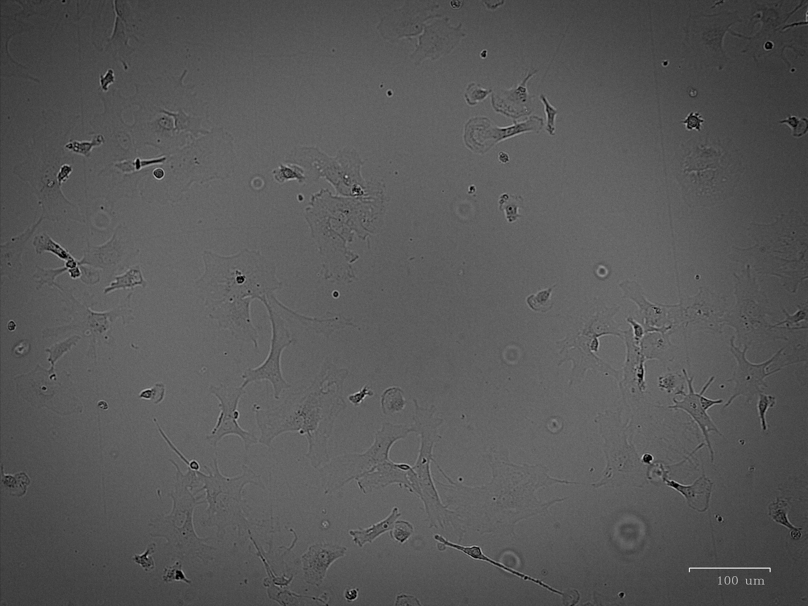
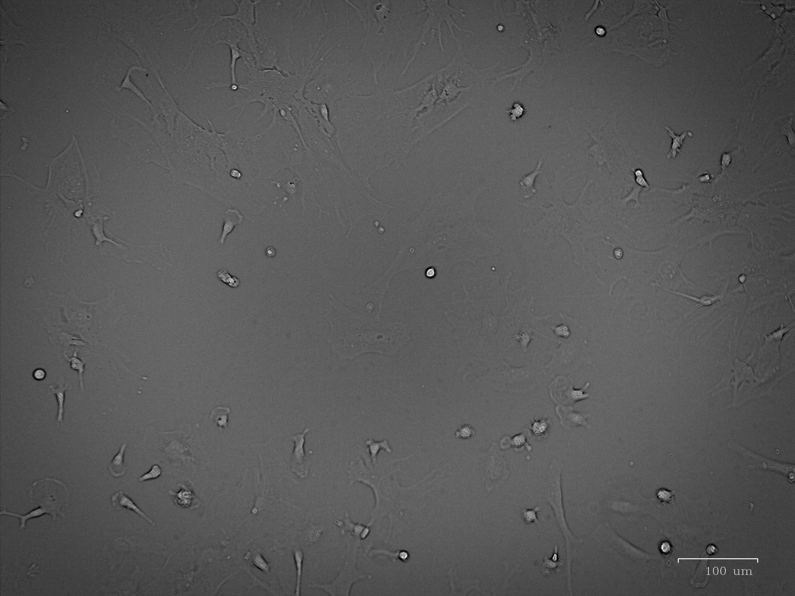
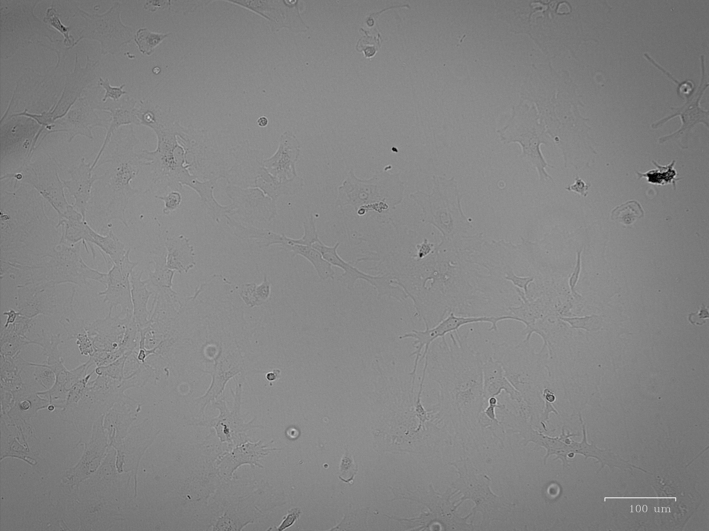
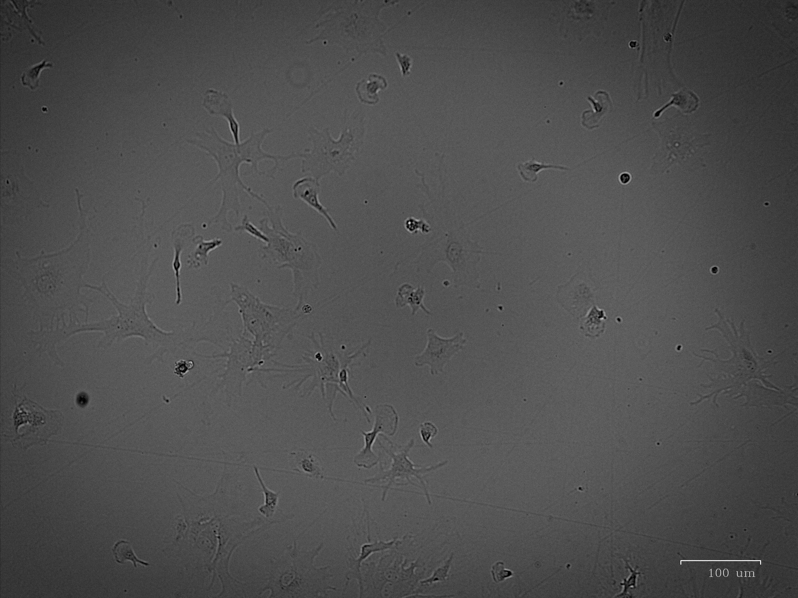
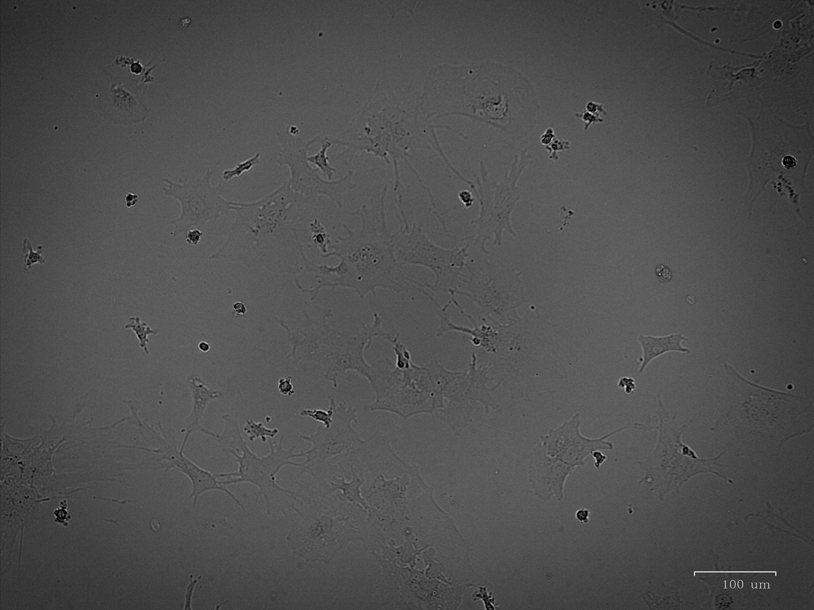
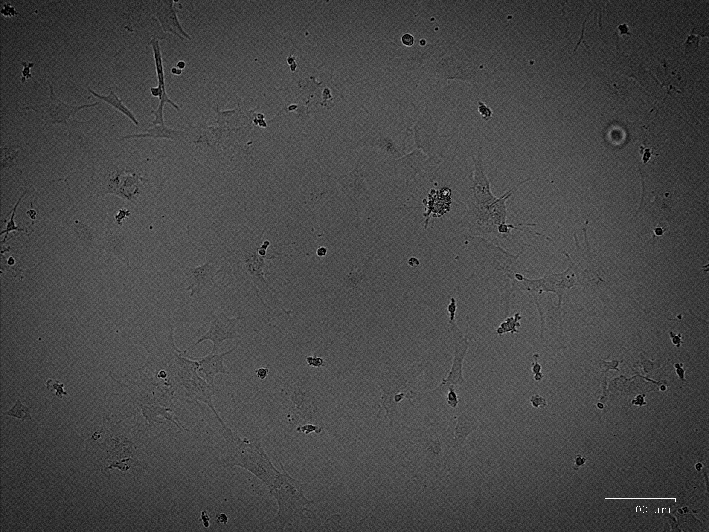

### Astro_before_treatment

[]

BRIGHTFIELD

### Astro_before_treatment_2

[]

BRIGHTFIELD

### DMSO_2uL

[]

BRIGHTFIELD

### DMSO_2uL_IL-1B_10uMng:ml_6hrs

[]

BRIGHTFIELD

### same_time_WIN_1uM

[]

BRIGHTFIELD

### same_time_WIN_1uM_IL-1B_10uMng:ml_6hrs

[]

BRIGHTFIELD

### same_time_WIN_10uM

[]

BRIGHTFIELD

### same_time_WIN_10uM_IL-1B_10uMng:ml_6hrs

[]

BRIGHTFIELD

