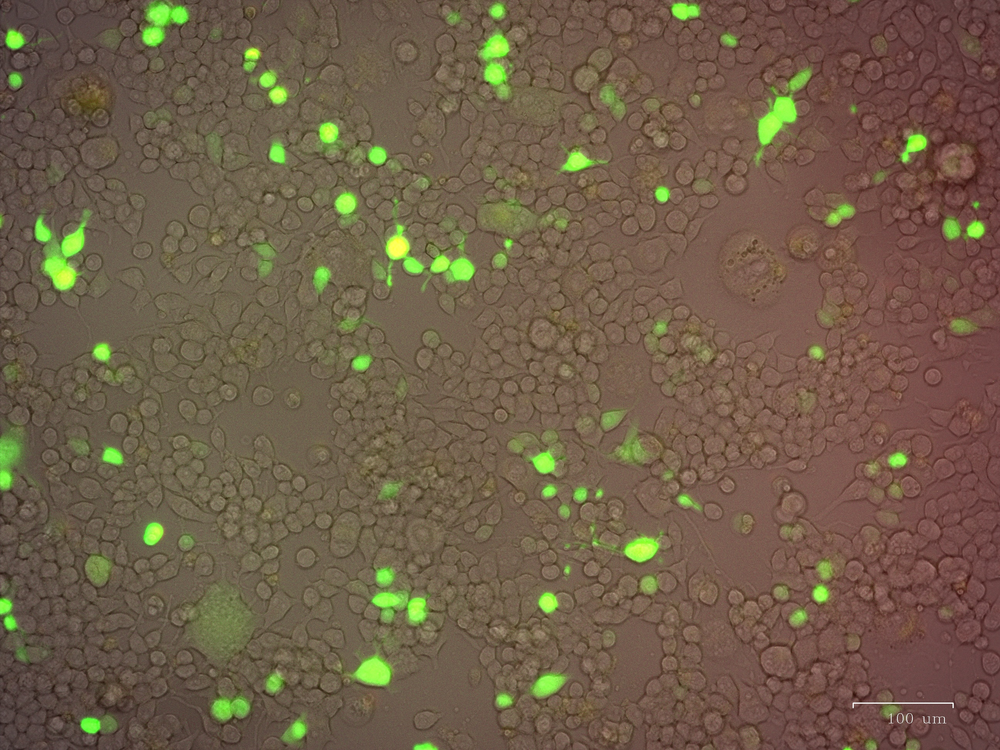
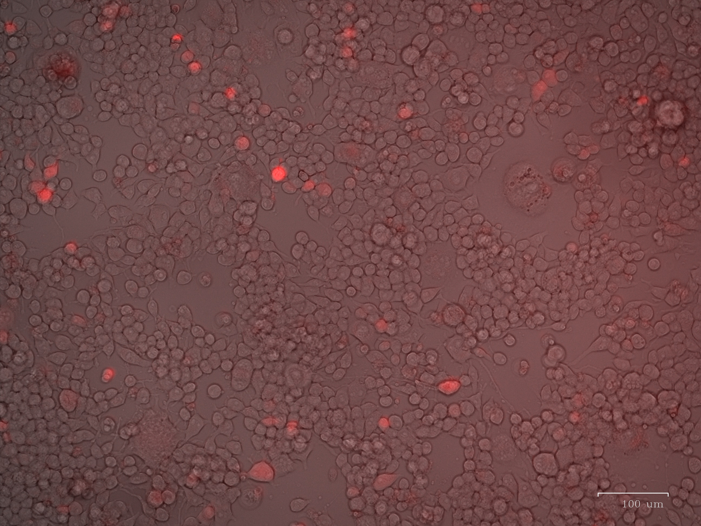
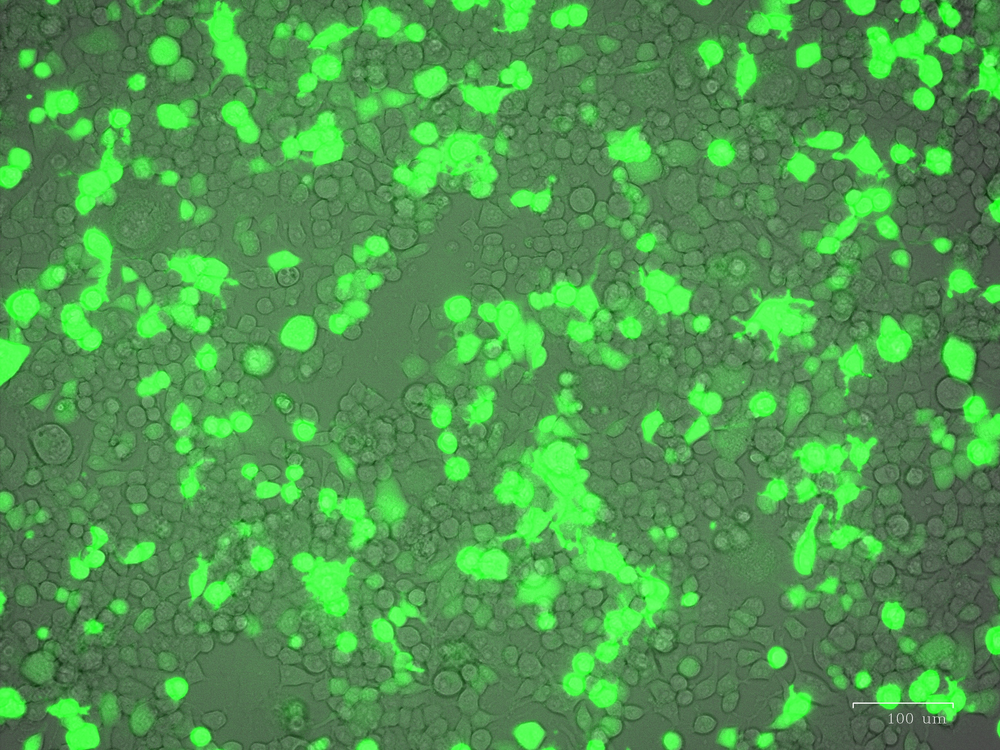
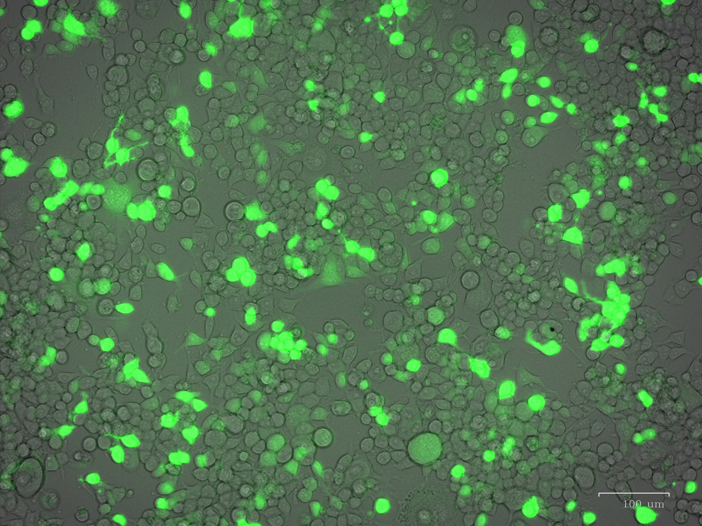

### N2A_gfp_LipoD1:3_48hrs

[]

N2A_gfp_LipoD1:3_48hrs.jpg

### N2A_linearization_of_dual_LipoD1:3_48hrs

[]

N2A_linearization_of_dual_LipoD1:3_48hrs.jpg

### N2A_linearization_of_dual_LipoD1:3_48hrs_all_channels

[]

N2A_linearization_of_dual_LipoD1:3_48hrs_all_channels.jpg

### N2A_linearization_of_dual_LipoD1:3_48hrs_red

[]

N2A_linearization_of_dual_LipoD1:3_48hrs_red.jpg

### N2A_pLenti_original_LipoD1:3_48hrs

[]

N2A_pLenti_original_LipoD1:3_48hrs.jpg

### N2A_pLenti_original_LipoD1:4_48hrs

[]

N2A_pLenti_original_LipoD1:4_48hrs.jpg

