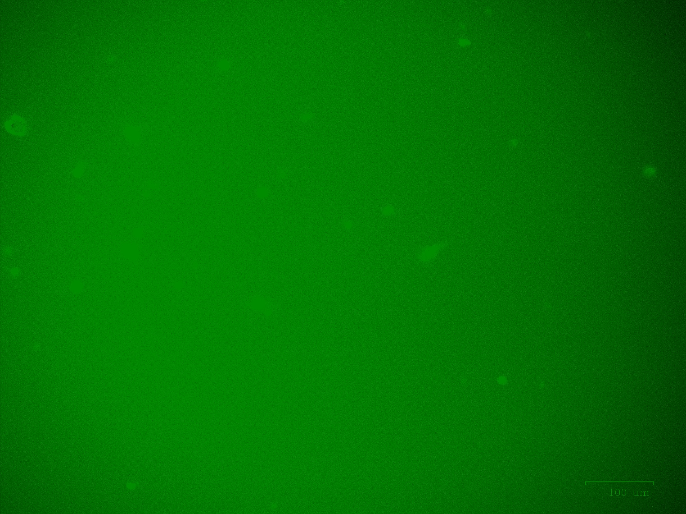
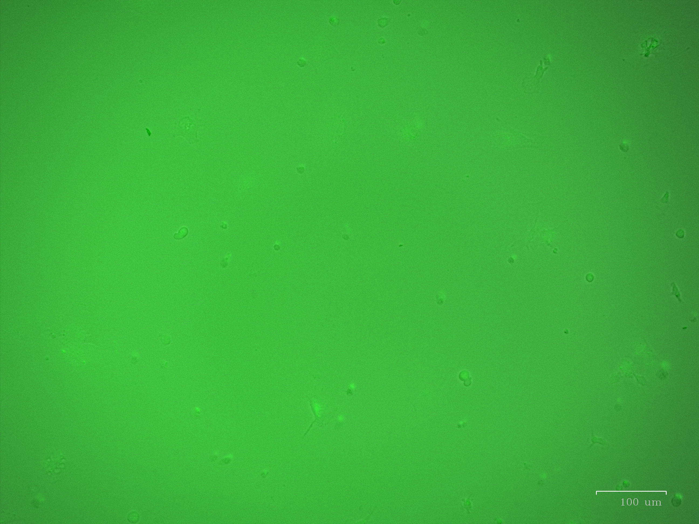

# as moi5 pr5.jpg

[] | [] | []

[]

# as moi10 py5.jpg

[] | [] | []

[] | [] | []

# as moi20 pr10.jpg

[] | [] | []

[] | [] | []

# astro moi1.jpg

[] | [] | []

[]

# as moi 5 py10.jpg

[] | []

# as moi5.jpg

[] | [] | []

[] | [] | []

# as moi1 py10.jpg

[] | [] | []

[] | [] | []

# as moi20.jpg

[] | [] | []

[] | [] | []

# as moi10 py10.jpg

[] | [] | []

[] | [] | []

# as moi10 pr5.jpg

[] | [] | []

[] | [] | []

# as moi5 py5.jpg

[] | [] | []

[] | [] | []

# nt astro wed.jpg

[] | []

# as moi5 pr10.jpg

[] | [] | []

[] | [] | []

# as nt.jpg

[] | []

# aav 0.jpg

[] | [] | []

[]

# aav 1.jpg

[] | []

# as moi20 py10.jpg

[] | [] | []

[] | [] | []

# as moi1 py5.jpg

[] | [] | []

[] | [] | []

# as moi10.jpg

[] | [] | []

[] | [] | []

# as moi20 py5.jpg

[] | [] | []

[]

# aav 5.jpg

[] | [] | []

[] | [] | []

# as moi1 pr10.jpg

[] | [] | []

[] | [] | []

# as moi20 pr5.jpg

[] | [] | []

[] | [] | []

# as moi10 pr10.jpg

[] | [] | []

[] | [] | []

# as moi1 pr5.jpg

[] | [] | []

[] | [] | []

# _GREEN_9415.jpg

[] | []

# aav1.jpg

[] | [] | []

[]

# as moi5 py10.jpg

[] | [] | []

[]

# as moi1.jpg

[] | []

# as moi 5 pr5.jpg

[] | []

# as moi 20 py5.jpg

[] | []

# aav0.jpg

[] | []

